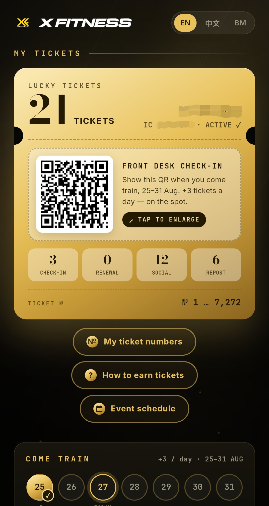
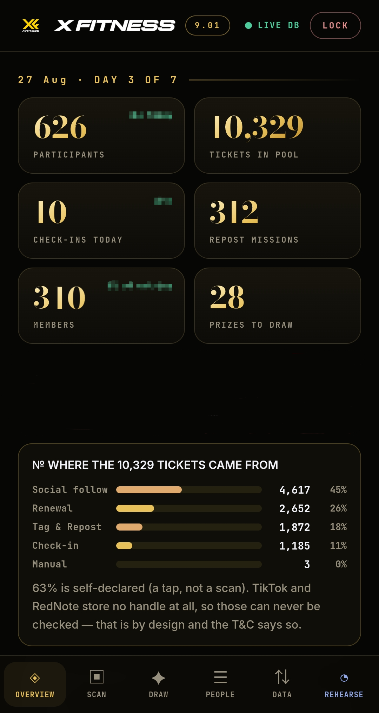
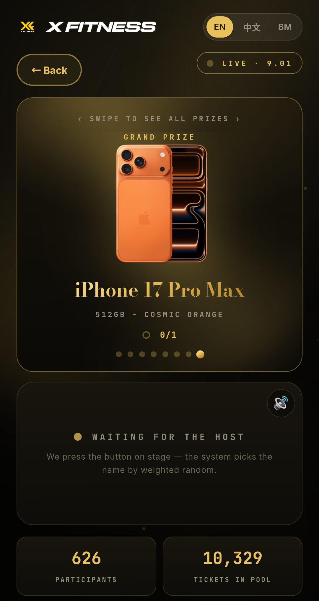
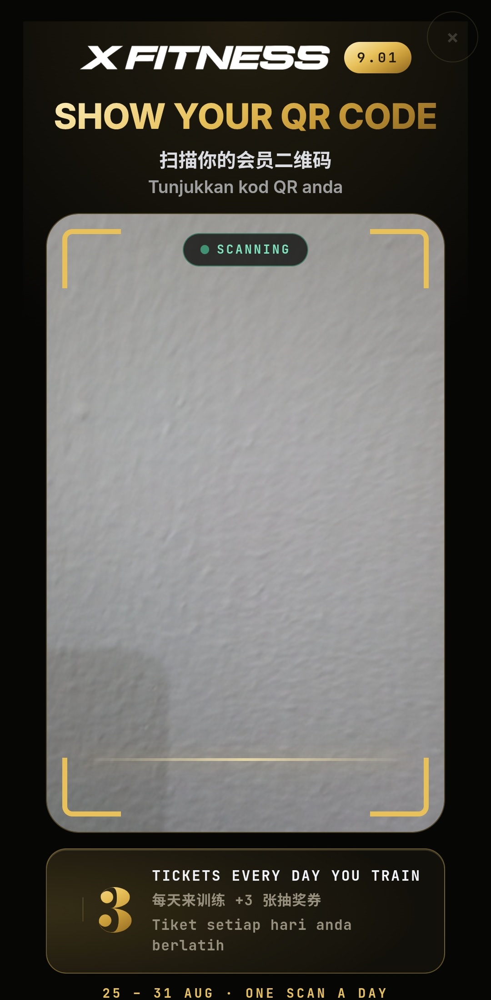

# 🎫 Lucky Draw 幸运抽奖系统

[English](README.md) · **中文**

**一套给实体商家用的抽奖系统 —— 真的跑过一场，不是做来展示的。**

顾客注册一次，靠到店和线上互动累积抽奖券，然后在大萤幕上看着得奖者被抽出来。

我们是 **X FITNESS GYM SDN. BHD.**，一家在马来西亚新山的健身房。周年抽奖时市面上找不到合用的东西，就自己写了一套，用真实奖品在满场的人面前跑完，然后开源出来，让下一家商家不用再造一次轮子。

**这套系统跟健身房无关。** 餐厅、美发店、连锁零售、汽车维修厂，换掉文案和图片就能跑同一场活动。

### ✨ 为什么值得你花时间看

- **纯静态档案就能跑。** 没有 build step、没有打包工具、没有框架、不用 `npm install` —— 两个 HTML 档加一个 Postgres 资料库
- **内建三语**：English、中文、Bahasa Malaysia
- **抽奖过程经得起全场盯着看**：每张券有永久序号、序号按真实取得时间顺序发放、而且没有任何「指定得奖者」的後门
- **票券帐本会自动对帐** —— 已发序号 vs 每个人的余额，不一致会在抽奖前几天就浮现，而不是在台上
- **证件号码到站即雜凑**，从不存明文
- **後端完整附上**：14 张表、42 个函式、约 1,500 行 SQL

---

## 📸 画面

| 顾客页面 | 後台控制台 |
|---|---|
|  |  |
| 一页搞定，不用下载 App。票券、来源、即时中奖机率。 | 总览、活动纪录、票券帐本。 |

| 抽奖之夜 | Kiosk 自助模式 |
|---|---|
|  |  |
| 中奖号码逐位滚动定格，然後名字升上来。 | 柜台放一台平板，顾客自己扫。 |

---

## 📱 功能

**顾客端** —— 一个网页，不用 App，不用下载。

- 用姓名、电话、证件号码和社群帐号注册一次
- 之後只用证件号码就能登入；QR code 就是他的参加代码
- 看得到自己持有的每一张券、每张从哪来、以及即时中奖机率
- 四种取得方式：到店打卡、续订月份、追踪社群、标记转发
- 全站 English / 中文 / Bahasa Malaysia

**员工端** —— 同一个网域下、密码保护的控制台。

- 扫顾客的 QR code 记录打卡，或把平板设成 Kiosk 模式让顾客自己扫
- 从你的收费系统汇出的 CSV 直接汇入续订或打卡纪录
- **写入前先对帐**：在任何东西碰到资料库之前，先看清楚谁会对不上、为什么
- 搜寻、编辑、调整、取消资格、删除参加者，每一个动作都有纪录和归属
- 票券帐本把已发序号和每个人的余额对起来，不一致在抽奖夜之前就看得到

**抽奖之夜** —— 为一整个房间的人设计的全萤幕画面。

- 中奖号码在金箔票券上逐位滚动，锁定後名字才从上方升入
- 节奏跟奖项等级挂钩：小奖走得快，前三名有倒数和最後一位数前的静默
- 所有音效都在浏览器即时合成 —— 没有音档可以搞丢
- 彩排模式会把票券换成另一个颜色，练习绝不可能被误认成正式开奖
- 得奖者无法领奖时，可以当场作废重抽

---

## 🎯 设计原则

这些都是从一场有真实奖品、有人在看的抽奖里长出来的。

**人是单位，票号是收据。** 名字显示在最上面、字最大；中奖票号在下方，绝不在上方。

**序号按真实取得的时间顺序发放。** 它们会散落在整个池子里，而不是一个人一整块连号。连号看起来就像暗箱作业，就算它不是 —— 而在台上，「看起来像什么」就是一切。

**抽奖是从票号里均匀随机抽**，不是加权抽人。这跟按持券数加权抽人在数学上完全等价 —— 我们跑了 44,000 次模拟验证（卡方 348.5，临界 351.8，自由度 343）—— 但这样中奖票号就变成一个可以拿在手上给大家看的真实物件。

**没有预设得奖者，没有覆写功能。没有做，以後也不会做。** 只要有人能指定得奖者，这套系统其他部分就全都没有意义了。

**证件号码从不储存。** 到站即正规化并雜凑，只留下雜凑值和末四码。要还原成原始号码是不可能的，包括我们自己。

**每一次人工修正都对当事人公开。** 员工手动调整票数，会带着理由显示在顾客自己的页面上。

---

## 🏗️ 架构

一个静态前端，透过 PostgREST 跟 PostgreSQL 讲话。**没有应用伺服器。**

```
sql/          完整後端：14 张表、42 个函式
index.html    顾客页面、抽奖台、注册、QR
admin.html    员工控制台、扫描器、Kiosk、汇入、帐本、抽奖控制
config.js     Supabase URL + anon key（已 gitignore，复制 config.example.js）
terms.html    由 build_terms.py 从 TERMS.md 产生 —— 绝对不要手改
assets/       图片、字型、两个自架的 JS library
```

没有 build step，没有打包工具，没有框架。两个 HTML 档、原生 JavaScript、当静态档部署。改它不需要任何工具链 —— 当维护的人是老板而不是全职工程师时，这件事很重要。

---

## 🚀 开始使用

### 1. 建资料库

[`sql/`](sql/) 里三个 SQL 档，**照顺序**在全新的 Supabase 专案上跑。不需要 migration 工具、不需要 build，直接贴进 SQL Editor 执行。

| 档案 | 内容 |
|---|---|
| `01_schema.sql` | 14 张表、索引、Row Level Security、预设值 |
| `02_public.sql` | 票券运算、票池产生器、7 个公开函式 |
| `03_admin.sql` | 带节流的密码认证、35 个 admin 函式 |

跑完立刻改密码，预设是 `changeme`：

```sql
select xf_admin_set_password('changeme', '你的长随机密码');
```

完整说明（包含抽奖机制和安全模型）在 **[`sql/README.md`](sql/README.md)**。想自己写後端的话，**[`API_CONTRACT.md`](API_CONTRACT.md)** 就是这三个档实作的规格。

资料表：

| 资料表 | 内容 |
|---|---|
| `participants` | 每位参加者一列：姓名、电话、雜凑後的证件、社群帐号 |
| `draw_tickets` | 每张已发出的券一列，带永久序号 |
| `checkins` | 每人每日一列 |
| `claims` | 社群追踪与转发的申报 |
| `app_config` | key/value 设定，包含 admin 密码摘要 |
| `prizes` | 等级、名称、数量 |
| `winners` | 每个中奖的奖项一列，附上中奖的序号 |

外加稽核表：`ticket_adjustments`、`participant_edits`、`admin_auth_fails`、`draw_voids`、`deleted_participants`。

### 2. 设定

```bash
cp config.example.js config.js
```

填入你的 Supabase URL、anon key、开奖时间和社群连结。`config.js` 已经在 `.gitignore` 里，这是刻意的。

接着改 `vercel.json`。它的 Content-Security-Policy `connect-src` 只白名单一个 Supabase host，目前写的是 `YOUR-PROJECT-REF`。**跳过这步的话，浏览器会在 CSP 那层静默挡掉每一次 API 呼叫** —— console 报的是 CSP violation 而不是网路错误，够你查一小时。

### 3. 换掉品牌

`assets/` 里全部是 X FITNESS 的美术素材，**不在** MIT 授权范围内。请全部换掉，见 [`LICENSE`](LICENSE)。

同时更新 `manifest.webmanifest`、`robots.txt`、`favicon.ico`，并且把 `sw.js` 的 cache key 加一号，否则回访的人会拿到旧档。

### 4. 重写条款

`TERMS.md` → `build_terms.py` → `terms.html`。**绝对不要直接改 `terms.html`**，它是产生出来的。现有内容是我们的，不会适用你的活动或你的司法管辖区。

### 5. 部署

任何静态主机都行。我们用 Vercel 接 GitHub push。没有东西需要编译。

---

## 🔄 改成你的行业

系统词汇已经是中性的：*参加者*、*打卡*、*续订月份*、*券*。剩下属于我们的是活动**内容**，集中在三个地方：

1. **`index.html` 的奖品区块** —— 我们的是健身房配套和礼品卡，你的不会是。
2. **促销区块** —— 我们的周年优惠。
3. **`index.html` 里的 `I18N` 物件** —— 三个语言区块，每个约 120 个 key。一个字串改一次，每个画面跟着变。

`admin.html` 里的 `pkgMonths()` 负责把你收费系统的方案名称对应到月数。我们的看得懂 `12-MONTH`、`JOIN ONLY` 这类。教它认你的 —— 就是一个小函式。

CSV 汇入器每个栏位都接受多种常见名称（`ic`/`nric`/`id`、`membertype`/`plan`/`package`/`product`、`name`/`fullname`），很多系统的汇出档不用改就能吃。

---

## ⚠️ 两个部署地雷

两个都让我们付出过真实的时间成本。**两个都无法在 Supabase SQL Editor 里重现**，这正是它们昂贵的原因。

**`ALTER DEFAULT PRIVILEGES` 可能让 `anon` 对每一张新建的表拥有完整权限。** 检查你的专案。如果适用，每建一张新表就要立刻：

```sql
revoke all on <table> from public, anon, authenticated;
alter table <table> enable row level security;
```

漏掉的话，那张表透过公开 REST endpoint 就是全世界可读可写。特别要验证存放 admin 密码摘要的那张 —— 浏览器直接开：

```
https://YOUR-REF.supabase.co/rest/v1/app_config?select=*&apikey=YOUR_ANON_KEY
```

要看到错误或 `[]`。吐出资料就代表任何人都读得到那张表。

**`authenticator` 角色预载了 `safeupdate`。** 函式里任何 `DELETE` 或 `UPDATE` 都必须带 `WHERE`，就算是 `WHERE true` 也行。SQL Editor 以 `postgres` 执行，不会警告你；这只会在部署後的 app 执行时才浮现。

---

## 🤝 参与贡献

`admin.html` 和 `index.html` 各是单一档案，各有约 125 个顶层宣告。**命名冲突是静默的** —— 重复的 `const` 或重复的物件 key 不会警告，第二个直接盖掉第一个。这在这个专案里造成过两次真实的生产环境 bug。

开 PR 之前请检查：

1. 没有重复的顶层 `const` / `let` / `function` 名称
2. 任何语言的 i18n 物件里没有重复的 key
3. 改文案时三个语言都改了
4. 所有表单控件 **≥16px** —— 低于这个数字 Safari 会在 focus 时自动放大，而且失焦後不会缩回来。`maximum-scale=1` 不是可接受的解法，现代 Safari 会忽略它，而且它会破坏无障碍的双指缩放
5. 内嵌 script 通过 `node --check`

**安全问题请不要开公开 issue**，见 [`SECURITY.md`](SECURITY.md)。

---

## 📄 授权

程式码采用 [MIT](LICENSE)。

X FITNESS 这个名称、logo、字标，以及 `assets/` 里的品牌美术素材，是 X FITNESS GYM SDN. BHD. 的商标与著作权，**不在**授权范围内。程式码随意使用；但请不要做出一个看起来像是我们出品的东西。

内含的第三方 library 及其授权列在 [`THIRD_PARTY_NOTICES.md`](THIRD_PARTY_NOTICES.md)。

---

<div align="center">

由 **X FITNESS GYM SDN. BHD.** 在马来西亚新山打造

</div>
